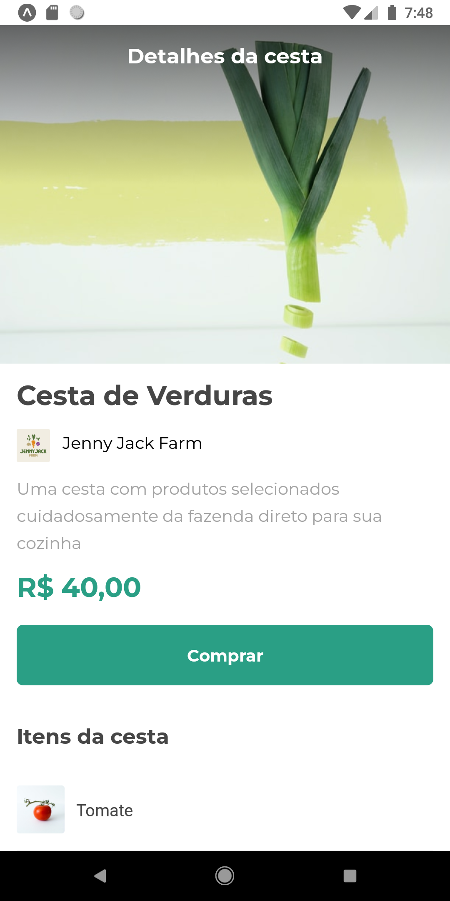
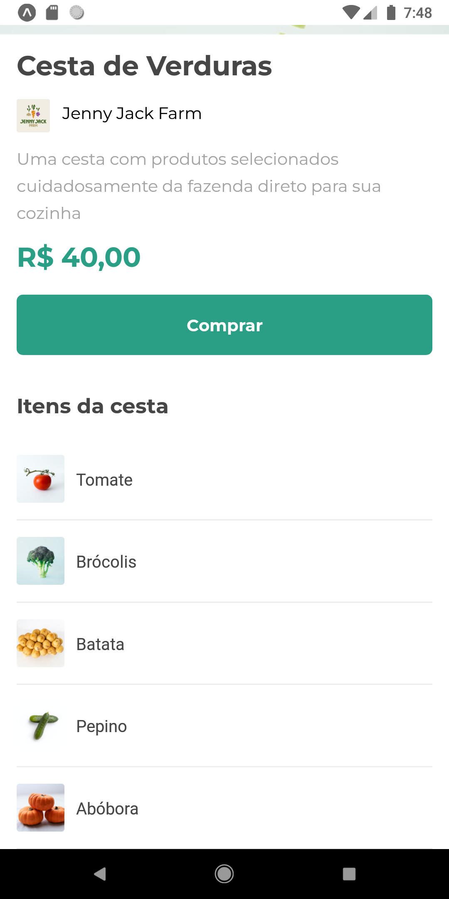

<h1 align="center">
    Orgs cesta
</h1>

  

  
  
  
    
   
  
  

<h4 align="center">
	🚧   Concluído 🚀 🚧
</h4>

## 💻 Sobre o projeto

Orgs cesta - é uma aplicação básica desenvolvida em React Native com Javascript para aprimorar e desenvolver alguns conceitos do desenvolvimento. Trata-se do layout de um aplicativo de compras num hortifruti.

---

## 🎨 Layout

  
  

